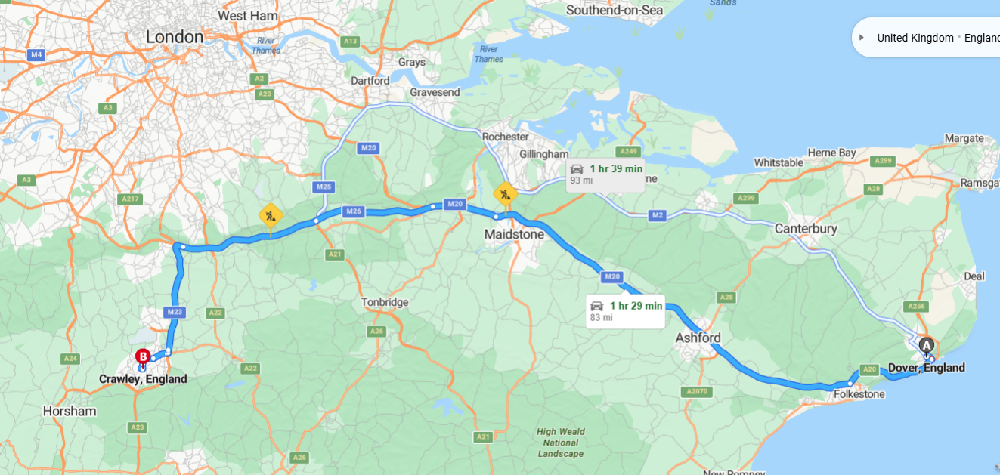
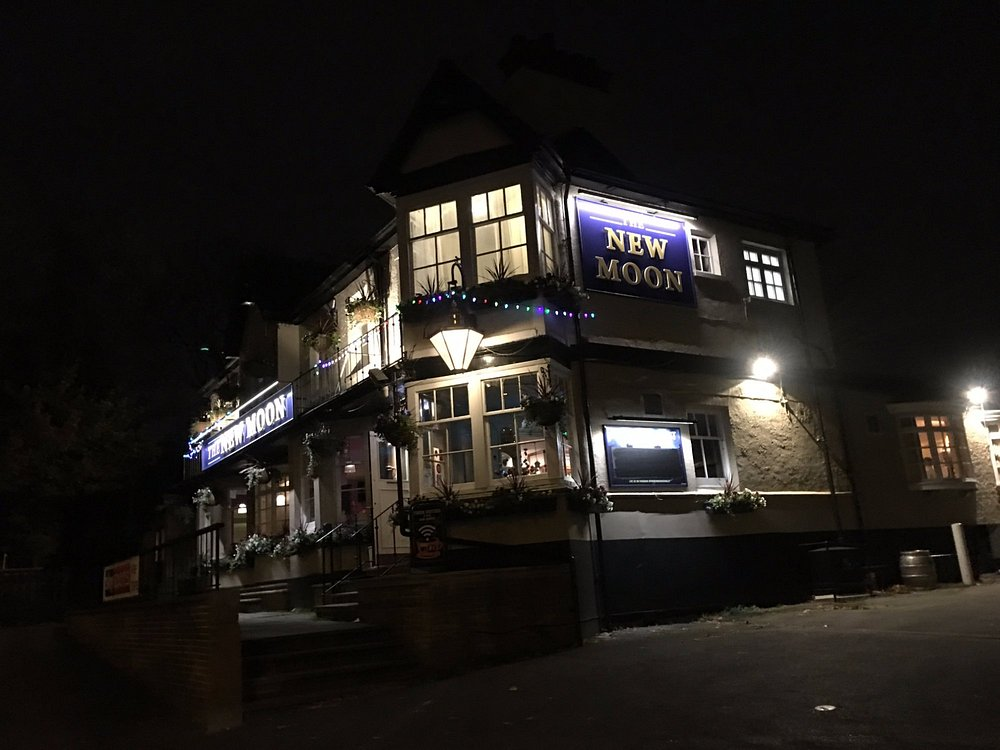
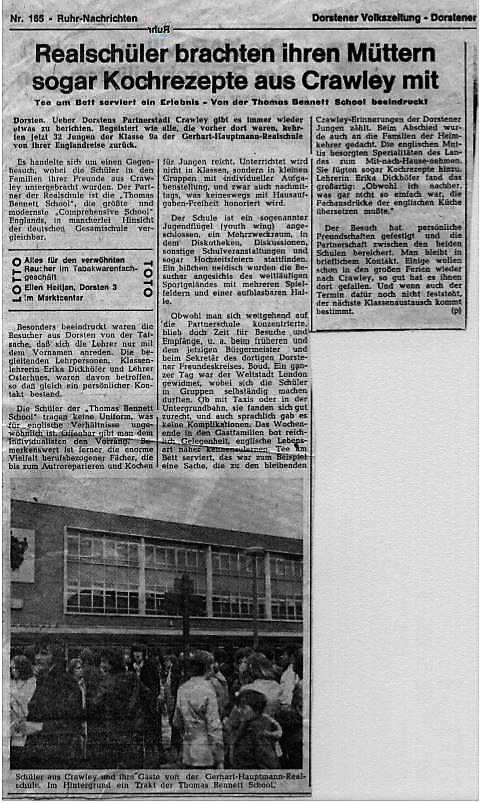

<small>Foto E. Schröer – Kodak Instamatic, 1974 - The George Hotel</small>

<small>Danke an meine Co-Autoren Kalle und [Dirk](https://ghs.myvortexcloud.com/dirk) für den Input und das Auffrischen des Erlebten</small>

### Die Vorbereitung und Abreise

Wie ich im letzten Blog beschrieben habe, wurde der Schüleraustausch mit Crawley durch einen Gegenbesuch offiziell besiegelt. Ende Juni, Anfang Juli 1974 war es dann soweit: Die Schüler der Klasse 10a machten sich auf den Weg, begleitet von ihrer Klassenlehrerin Frau Erika Dickhöfer und Herrn Osterhues. Schon auf der Hinfahrt gab es die ersten kleinen Abenteuer. Herr Osterhues, dem die Zigaretten ausgingen, musste seine Hemmungen überwinden und bat die Schüler um Nachschub – natürlich Samson, selbstgedrehte. Frau Dickhöfer, stets auf Zucht und Ordnung bedacht, war davon wenig begeistert.

Der Bus, organisiert vom Dorstener Reiseunternehmen Hortlik, wurde unser treuer Begleiter. Der Busfahrer, ein freundlicher Typ, war immer für einen Plausch zu haben.  

<small>v.l. Egbert Schröer - Joachim(Jockel) Klein - am Bus Hans- Josef Mälzer, dann Lothar Stein, Dieter Sojka, Ludger Stollbrink, ganz rechts Udo Ostrop</small>

Die Fährüberfahrt nach England war ein Erlebnis. Als schließlich die White Cliffs of Dover auftauchten, stieg die Aufregung. Nach weiteren 1,5 Stunden Fahrt auf der „falschen Seite“ erreichten wir erschöpft, aber gespannt unser Ziel: die Thomas Bennett School in Crawley.
Dort wurden wir schon von den Vetretern der Gastfamilien erwartet.

---

### Unterbringung bei Gastfamilien

Ich wurde von der Familie Leare aufgenommen. Mr. Leare holte mich von der Schule ab. Peter, der Sohn der Familie und unsere Gast in Deutschland, war auf einem Schulausflug und würde erst zwei Tage später zurückkehren. Sein Bruder Paul war bereits berufstätig, also nicht mehr an der Thomas-Bennett School. Besonders die kleine Schwester der Familie empfing mich herzlich und löcherte mich mit tausend Fragen über Deutschland.

Das Haus war ein typisches englisches Reihenhaus mit direktem Zugang vom Eingang zum „Living Room“. Die Küche war für deutsche Verhältnisse ungewöhnlich, mit Barhockern und einer Theke vor dem Gasherd und Backofen. Hinter dem Küchenbereich befand eine Tür mit Ausgang zum ein kleinen Garten. Eine schmale Treppe führte nach oben in die 2 Etagen darüber.

Am nächsten Morgen weckte uns Mrs. Leare mit einer Tasse Tee ans Bett (Paul und ich teilten uns das Zimmer) – eine für mich ungewohnte, aber sehr angenehme Geste. Konnte man sich wirklich daran gewöhnen. Gemessen an meinen Familienverhältnissen war dies mehr als wohltuend. Nach einem klassischen englischen Frühstück mit Bacon und Eggs holte mich Chris, ein englischer Schüler, der bei dem Besuch in Dorsten bei Bernhardt Bittner untergebracht war, ab, und wir gingen gemeinsam zur Schule.

---

### Erste Eindrücke vom Schulalltag

Der Unterricht an der Thomas Bennett School war ganz anders als in Deutschland. Besonders beeindruckend fand ich die praktischen Experimente im Chemie- und Physikunterricht. Einen praktischen Werksunterricht gab es auch. Dort schreinerte man kleiner Dinge und lernte den Umgang mit Säge, Bohr- und Schleifmaschinen. Auch die Ganztagsschule war ungewohnt. Mittags hätte ich eigentlich zur Familie Leare zurückkehren sollen, was ich anfangs missverstanden hatte. Frau Leare wartete vergeblich auf mich. Zum Glück klärte sich das schnell, und ab dem nächsten Tag lief alles reibungslos – es gab klassische Fish & Chips.

---

### Freizeit und Abenteuer

Natürlich waren wir als Jugendgruppe voller Entdeckerdrang. Trotz Begleitung schafften wir es, die örtlichen Pubs zu erkunden und auf eigen Faust loszuziehen. Frau Dickhoefer fand das gemaess ihrem Lehrauftrag natürlich nicht gut. Besonders beliebt war „The New Moon“. Dank Willi, der über 18 war, konnten wir den Altersbeschränkungen meistens entkommen – ein echtes Abenteuer!

Das Abenteuer endete für Kalle und Akki allerdings mit einer Begegnung mit den englischen Bobbies. Im jugendlichen Übermut zogen sie sich an einem Bretterzaun hoch, um darüber zu schauen. Die im Garten sitzende Bewohnerin machte einen Höllenlärm und rief die Polizei. Schlecht für die beiden.

---

### Ein Angelausflug

Peter und ich teilten eine Leidenschaft: das Angeln. So machten wir uns auf zum nahe gelegenen Tilgate Park und - **Tilgate Lake**.  

Wir fingen zunächst ein paar Köderfische, um dann auf Hechtfang zu gehen. Es waren einige Angler an dem lauen Abend da, aber nichts tat sich. Ich fragte Peter, ob er keine Blinker hätte. Die Ausstattung war etwas dürftig, aber ich fand einen guten Heintz Blinker, ziemlich große Ausführung. In England gibt es nicht nur Linksverkehr, sondern auch die Kurbel einer Angelrolle ist an der „falschen“ Seite, hier also dann "rechts". Ein Stahlvorfach hatte er nicht, und so musste ein Kevlar-Vorfach herhalten.

Nach einigen Würfen spürte ich einen kleinen Schlag in der Rute. Nichts tat sich – ich dachte an einen Hänger und kurbelte die Schnur auf Spannung. In dem Moment kam der Hecht an die Oberfläche und versuchte, mit Rollbewegungen den Haken loszuwerden. Vergeblich! Ich drillte den Brocken – schätzungsweise 10 Pfund oder mehr – so gut ich konnte. Allerdings trieb mich die Kurbel auf der „falschen“ Seite in den Wahnsinn. Peter's Schwester flitzte nach Hause, um den Eltern Bescheid zu sagen. Die kamen wenig später mit einem Fotoapparat.

Der Hecht stieg mehrfach aus dem Wasser und versuchte, sich loszuschütteln. Dann – *peng* – riss das Kevlar-Vorfach, der Blinker flog durch die Luft, und der Hecht tauchte ab. Das war’s. Dumm haben wir geschaut.

Sogar die Enten im Park schienen uns auszulachen

  

    
    
  

  <em>Gallery / <a target="_blank">Fotos: Egbert Schroeer</a></em>

---

### Die Schuldisco und Kalles Jacke

Beinahe fiel auch die Abreise ins Wasser – zumindest für Kalle. Ihm wurde seine Jeansjacke in der Schuldisco gestohlen. Darin befanden sich nicht nur sein Portemonnaie, sondern auch sein Reisepass. Der Aufwand, einen Interimspass zu bekommen, war erheblich. Aber wofür ist eine Klassenlehrerin da?

Kalle erinnert sich: „Meine Jeansjacke wurde mir mitsamt aller Papiere und meinem Geld gestohlen, während wir in der Schuldisco waren. Frau Dickhöfer war ziemlich sauer, weil sie dachte, wir wären mal wieder auf eigene Faust losgezogen. Das konnte ich jedoch klären, da mein Gastgeber zusammen mit seiner kleinen Schwester die Idee hatte, in die Disco zu gehen. Die beiden waren dabei und hatten statt harter Getränke etwas Softeres besorgt – ‚Cydrebeer‘. Hat zwar gedauert, aber mit der Zeit machte es auch lustig.“

Trotzdem blieb die Panik nicht aus, als die Jacke verschwunden war. Die halbe Schule wurde auf den Kopf gestellt, und viele halfen mit. In der Jacke befanden sich neben dem Personalausweis auch Kalles frisch erstandener Führerschein der Klasse 4. „Warum ich den überhaupt mitgenommen hatte, weiß ich bis heute nicht. Aber seit dieser Zeit lief ich noch jahrelang mit einem ‚Ersatzführerschein‘ herum, gekennzeichnet mit zwei gekreuzten Balken. Leider waren diese Balken bei uns in Good Old Germany als sogenannte ‚Säuferbalken‘ bekannt, was ich bei jeder Polizeikontrolle erklären musste.“

Ein halbes Jahr nach der Rückkehr tauchte die Jacke, inklusive der Papiere – allerdings zerrissen –, wieder auf. Man hatte sie auf dem Schuldach gefunden.

---

### Erinnerungen an besondere Momente

Dirk Ruschitzka erinnert sich, dass wir das legendäre Deutschland-Holland-Endspiel der WM 1974 im Chemiesaal der Schule sahen. Das Ergebnis ist bekannt: 2:1 für Deutschland! Eine weniger angenehme Erinnerung war Willis Einkauf von Whisky, der für uns alle neu war. Dirks Gasteltern hatten lange damit zu tun, die Flecken vom Wohnzimmerteppich zu entfernen. Frau Dickhöfer fand das am nächsten Tag gar nicht amüsant.  

---

## Ausflüge und Erlebnisse

Neben dem Schulalltag gab es auch spannende Ausflüge:  

- **Brighton:** Eine beeindruckende Küstenstadt mit ihrem berühmten Pier.  
Wir durften in kleinen Gruppen die Pier und Brighton erkunden. Besonders spannend fanden wir die Spielautomatenhallen, die eine fast magische Anziehungskraft auf uns ausübten. Flipper, Spielautomaten und andere Attraktionen sorgten für viele lachende Gesichter.
Das Wetter war so lala, trotzdem rannte der ein oder andere zumindest bis zu den Knien in's Meer.

Erste Bild bin ich und ganz rechts Friedrich Schmidt.
Auf dem zweiten Bild rechts mit der gelben Regenjacke ist Dirk Ruschitzka und links neben ihm Willi Huesken

  

    
    
    
  

  <em>Gallery / <a target="_blank">Fotos: Egbert Schroeer</a></em>

- **London:** Eine pulsierende Metropole mit Highlights wie dem Tower of London und der Themse.  
Nach einem informativen Pflichtprogramm hatten wir die Möglichkeit, die Stadt in kleinen Gruppen zu erkunden. In einem Pub, das wir besuchten, glaubte ich meine Kamera verloren zu haben. Doch eines der Mädchen, die uns in der Woche nicht aus den Augen liessen und uns begleiten durften, hatte sie an sich genommen, und hatte einen Heidenspass, als sie mich in Panik sah. Meine Erleichterung war gross, als ich die Kamera wieder in den Händen hielt.

  

    
    
    
  

  <em>Gallery / <a target="_blank">Fotos: Egbert Schroeer</a></em>

---

### Die Rückfahrt

Der Abschied war herzlich, und wir tauschten noch die letzten Adressen aus. Peter kam schließlich noch vorbei, um seine Schulden zu begleichen. Wir hatten auf das Spiel Deutschland gegen England gewettet, und wie man es von Engländern kennt – echte Sportsleute, die zu ihrem Wort stehen.

Die Verpflegung, die mir Mrs. Leare für die Rückreise mitgab, hätte locker für zwei Tage gereicht. Es gab gefüllte kleine Pasteten und Sandwiches, liebevoll in den typischen englischen Schichten belegt – einige mit Senf, andere mit Mayonnaise.

Auf der Fähre wurde es dann turbulent, als wir auf eine Mädchenklasse aus England trafen. Es herrschte ein ausgelassenes Chaos, und die Mädchen schrieben mit Kugelschreibern und Filzstiften ihre Adressen auf meinen Rücken sowie auf die Rücken einiger Mitschüler aus meiner Klasse. Leider war das Ganze wenig hilfreich: Zum einen hätte die Schrift in Spiegelschrift sein müssen, und zum anderen war sie bis zu unserer Ankunft zu Hause komplett unleserlich. Trotzdem war es eine lustige Aktion, an die ich mich noch heute mit einem Schmunzeln erinnere.

Als wir schließlich in Dorsten ankamen, wartete die Presse bereits auf uns. Dieser Austausch war der erste offizielle Besuch einer Dorstener Schule im Ausland, was natürlich für Aufmerksamkeit sorgte. Ein Zeitungsbericht wurde verfasst, und bis heute muss ich über den vermeintlichen Austausch von Kochrezepten schmunzeln. Es mag stimmen, aber für uns standen damals wohl andere Dinge im Vordergrund.

### Fazit

Nach 50 Jahren erinnert man sich an viele Details, sowohl an wichtige als auch an weniger bedeutende. Und wenn alles gut läuft, wird es im Oktober ein Wiedersehen geben – teils persönlich, teils virtuell. Die drei Organisatoren planen ein Klassentreffen. Wenn nicht jetzt, wann dann?

Zu Peter und seiner Familie habe ich den Kontakt verloren. Doch auf LinkedIn konnte ich ihn wiederfinden und erfuhr, dass Peter heute -0 wie ich -in den USA lebt, in Bedford, New Hampshire. Sein Bruder blieb in Crawley und führt dort ein Handwerksgeschäft.

