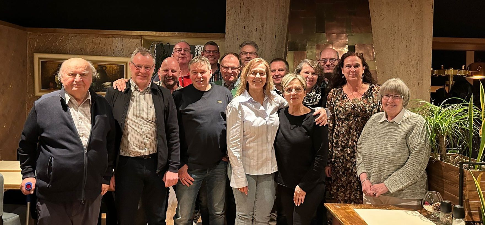

Am vergangenen Wochenende war es wieder soweit: Die ehemalige Klasse 10b des Abschlussjahrgangs 1985 der GHS traf sich zu ihrem inzwischen fünften Klassentreffen. Es war, wie immer, ein magischer Abend voller Erinnerungen und Austausch über vergangene und aktuelle Zeiten.

13 ehemalige Mitschülerinnen und Mitschüler waren anwesend, begleitet von den geschätzten Eheleuten Braun, die viele von uns noch aus unserer Schulzeit kennen. Grüße wurden auch an die Brauns von Mitgliedern der Facebook-Gruppe der Ehemaligen der GHS übermittelt, die uns in unserer gemeinsamen Zeit so geprägt haben.

Ein besonderes Thema des Abends war die Zukunft unserer Klassentreffen: Es wurde einstimmig beschlossen, den Zeitraum zwischen den Treffen künftig deutlich zu verkürzen, um sich häufiger zu sehen.

Ein nachdenklicher Moment entstand, als wir über unsere ehemaligen Lehrer sprachen. Von den Lehrkräften, die uns damals begleiteten, sind inzwischen leider 24 verstorben. Doch wir freuen uns, dass Herr Klocke (77 Jahre), Herr Flötgen (90 Jahre) und Herr Kronen (98 Jahre) noch unter uns sind. Zuletzt verstorben sind im Januar dieses Jahres Karl Werner Dickhöfer und in den vergangenen Jahrzehnten unter anderem H. Sellheyer, [H. Fißer](https://ghs.myvortexcloud.com/blog/abschlussfahrt-1974),
H. Reinthal, Herr Bohn, Herr Scharf, Frau Meißner, Herr Bruns, Herr Rünker, Herr Kuon und [Herr Glackemeyer](https://ghs.myvortexcloud.com/blog/klassenfahrt-drachenfels).

Auf dem Bild von links nach rechts zu sehen sind:
Gerhard Braun, Karsten Pilarczyk, Hans-Volker Hartmann, Jürgen Beule, Andreas Spirres, Oliver Tilsner (Schultz), Theo Aldenhoff, Holger Tewes, Ruth Selzer (Schimanski), Dieter Fabricius, Tanja Carstensen (Warnecke), Stefanie Hartmann (Wember), Christian Trösken, Heike Pollender (Schaffeld), Henrike Braun.

Zum Abschluss des Abends blickten wir voller Vorfreude auf das nächste Treffen und wünschten der ehemaligen 10c viel Spaß bei ihrem ersten Klassentreffen, das für Juni geplant ist.

Wir freuen uns schon jetzt auf weitere unvergessliche Abende.

